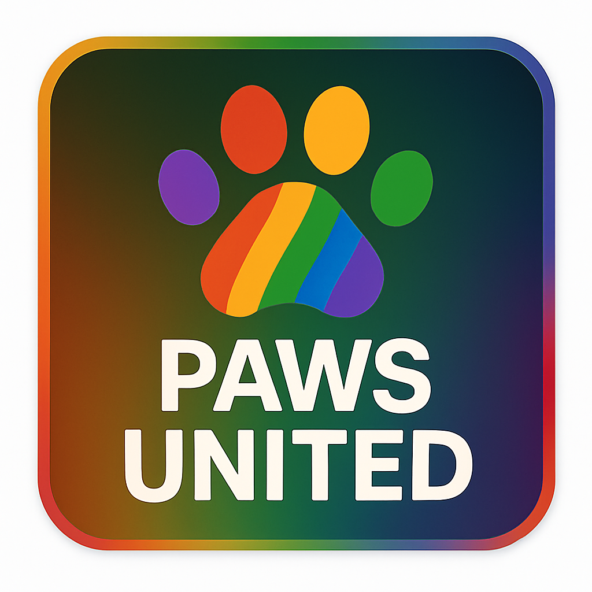

# PAWS UNITED

A United Creator Collective — One Community. Many Voices.



## About

PAWS UNITED is a curated Discord community representing high-quality streamers across platforms including TikTok, Twitch, YouTube, and Kick. This repository contains the Jekyll-based landing page for [pawsunited.info](https://pawsunited.info).

## Features

- **Curated Membership** — Quality over quantity
- **Cross-Platform** — Creators from Twitch, YouTube, TikTok, and Kick
- **Creator Collaboration** — Find partners for streams, events, and content
- **Moderated Discord** — A high-signal, spam-free environment
- **Events & Collabs** — Regular community events and collaborative streams

## Development

This site is built with [Jekyll](https://jekyllrb.com/) and is compatible with [GitHub Pages](https://pages.github.com/).

### Local Development

```bash
# Install dependencies
gem install bundler jekyll

# Run development server
jekyll serve
```

Visit `http://localhost:4000` to view the site.

### File Structure

```
├── _config.yml           # Jekyll configuration
├── _data/
│   └── streamers.yml     # Creator data
├── _includes/            # Reusable components
│   ├── hero.html
│   ├── about.html
│   ├── creators.html
│   ├── creator-card.html
│   ├── features.html
│   ├── trust.html
│   ├── cta.html
│   └── footer.html
├── _layouts/
│   └── default.html      # Main layout
├── assets/
│   └── css/
│       └── main.css      # Corporate Design System
└── index.html            # Landing page
```

### Adding Creators

Edit `_data/streamers.yml` to add or modify featured creators:

```yaml
- name: "CreatorName"
  primary_platform: "twitch"  # twitch, youtube, tiktok, or kick
  secondary_platforms:
    - "youtube"
    - "tiktok"
  tagline: "Short description"
```

## Design System

The site follows the PAWS UNITED Corporate Design System:

- **Primary Colors**: Midnight Green (#0F2A24), Deep Navy (#0B1A2B), Off White (#F4F5F2)
- **Accent Colors**: Pride Red (#E84B3C), Gold Yellow (#F4B63E), Emerald Green (#3FA46A), Royal Blue (#3A6EDC), Violet (#7B4DB5)
- **Typography**: Inter (Google Fonts)

## License

See [LICENSE](LICENSE) for details.
